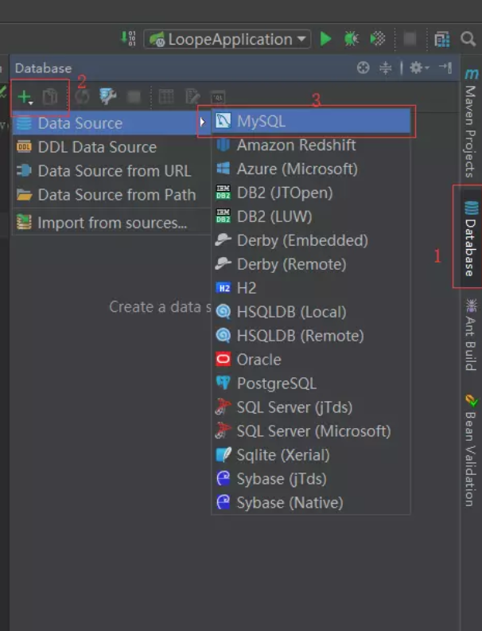
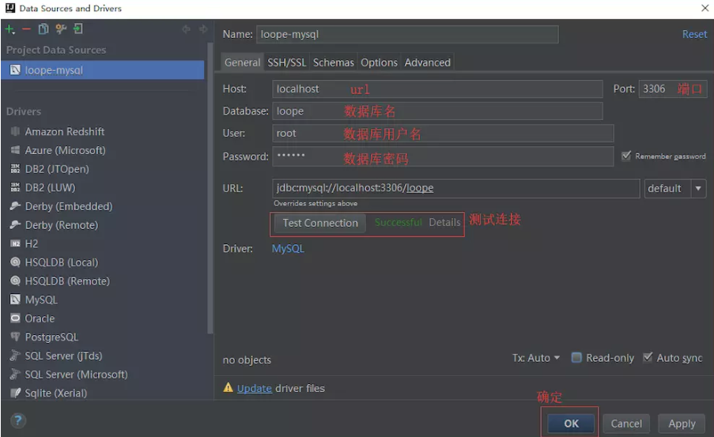

[TOC]

# JPA生成实体类

1.连接数据库

点击database窗口，添加数据源







2.点开file->project structure


3.连接数据库

完成上述操作后，会出现persistence


## 

# 实体类自动创建表

JPA不仅可以从数据表生成实体类，也可以由实体类自动创建数据表。如果你非常熟悉实体类的创建，或者已经有了实体类，只需要在配置文件中添加一个简单的配置就可以自动创建数据表了

```
jpa:
    hibernate:
        ddl-auto: create 
```

- ddl-auto:create---每次运行该程序，没有表格会新建表格，表内有数据会清空
- ddl-auto:create-drop---每次程序结束的时候会清空表
- ddl-auto:update---每次运行程序，没有表格会新建表格，表内有数据不会清空，只会更新
- ddl-auto:validate---运行程序会校验数据与数据库的字段类型是否相同，不同会报错